## Node.js 설치

MCP 서버를 사용하기 위해 [Node.js](https://nodejs.org/ko/download/) 를 설치 합니다.

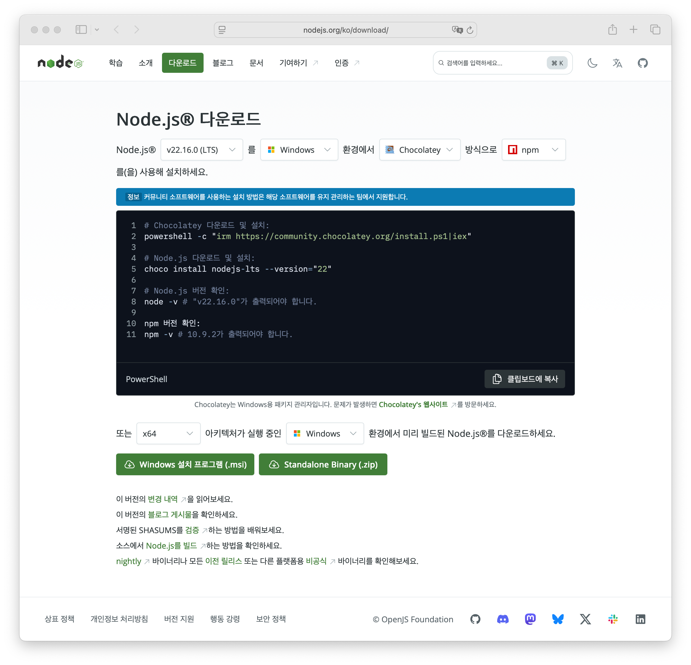

---

## Gmail MCP Server 설치 및 구성

### 1. Google Cloud Project 생성

[Google Cloud Console](https://console.cloud.google.com/) 로 이동 합니다.

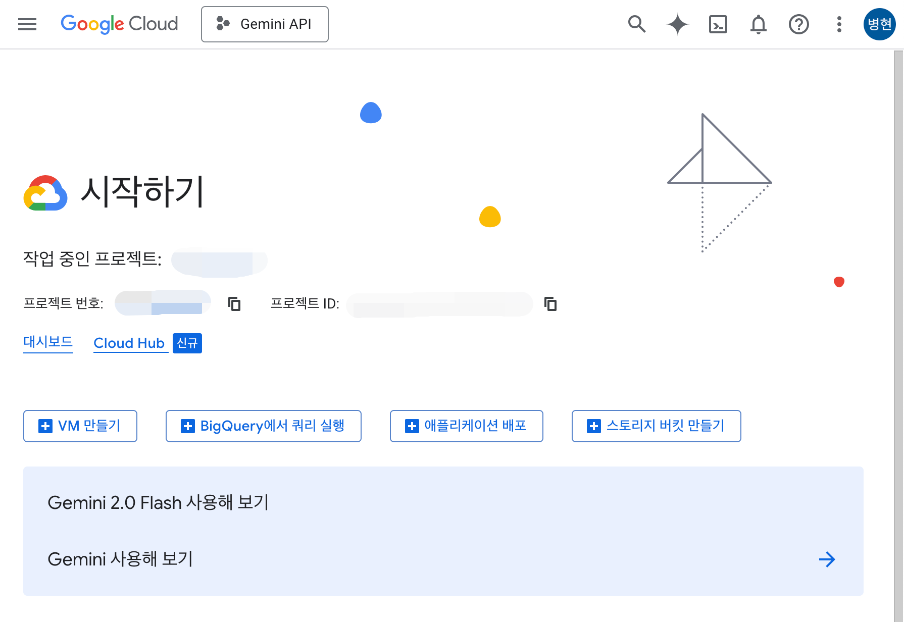

새로운 프로젝트를 만들거나 기존 프로젝트를 선택하세요.

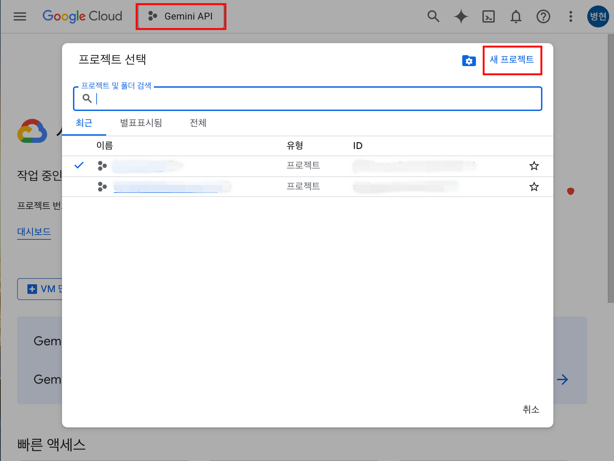

새 프로젝트를 선택하여 생성하는 경우 다음과 같이 만들 수 있습니다.

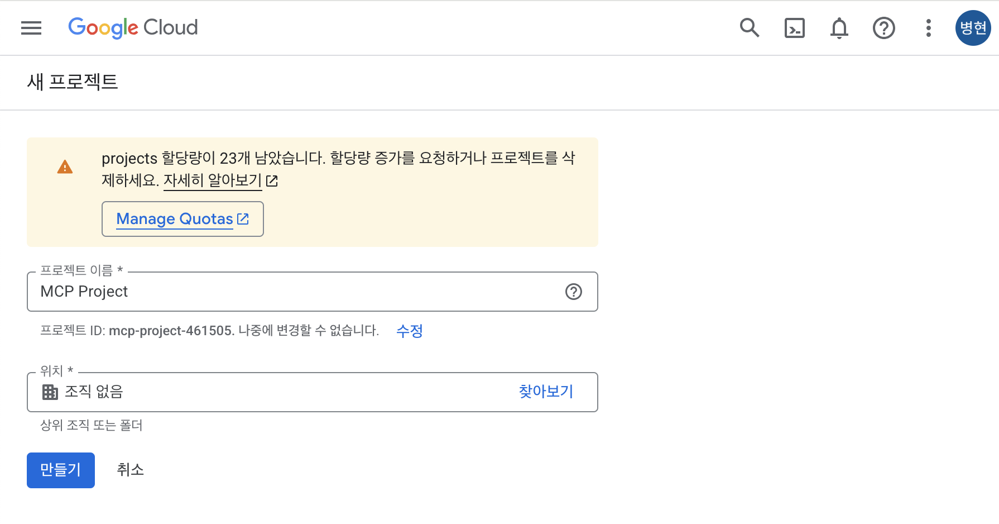

사용할 프로젝트를 선택합니다.

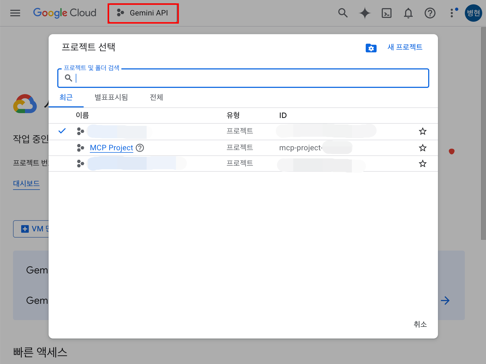

### 2. OAuth 2.0 동의 화면 구성
1. 화면 상단의 검색에서 "OAuth 동의 화면"을 찾아 이동합니다.
2. 개요 화면에서 시작하기 버튼을 클릭하여 앱 정보를 등록합니다.

- #### 앱 정보
  - 앱 이름: <임의의 이름을 작성하세요.>
  - 사용자 지원 이메일: <자신의 이메일 주소를 선택하세요.>
- #### 대상
  - [ ] 내부
  - [x] 외부
- #### 연락처 정보
  - 이메일 주소: <자신의 이메일 주소를 입력하세요.>
- #### 완료
  - [x] Google API 서비스: 사용자 데이터 정책에 동의합니다.

### 3. 앱 게시 혹은 테스트 사용자 등록
1. 화면 상단의 검색에서 "OAuth 동의 화면"을 찾아 이동합니다.
2. 왼쪽 메뉴 패널에서 "대상"을 클릭합니다.
3. 테스트 중에서 "앱 게시"로 프로덕션으로 전환하거나 테스트 사용자를 추가 합니다.

### 4. Gmail API 활성화
1. 화면 상단의 검색에서 "API 및 서비스"를 찾아 이동합니다.
2. 왼쪽 메뉴 패널에서 "라이브러리"를 클릭합니다.
3. Gmail API 를 검색하여 이동 합니다.
4. 사용 버튼을 클릭하여 Gmail API 를 활성화 합니다.

### 5. OAuth 클라이언트 ID 발급 받기
1. 화면 상단의 검색에서 "API 및 서비스"를 찾아 이동합니다.
2. 왼쪽 메뉴 패널에서 "사용자 인증 정보"를 클릭합니다.
3. "+ 사용자 인증 정보 만들기" 를 찾아 클릭하고 "OAuth 클라이언트 ID" 를 선택 합니다.
4. 애플리케이션 유형은 "데스크톱 앱"으로 지정하고 이름은 임의로 작성합니다.
5. 만들기 클릭 후 생성된 팝업창에서 "JSON 다운로드"로 JSON 파일을 받습니다.

### 6. OAuth 클라이언트 ID Gmail MCP Server 에서 사용할 수 있도록 이동
1. 다운로드 받은 JSON 파일을 `gcp-oauth.keys.json`으로 변경합니다.
2. 사용자 디렉토리에 `.gmail-mcp` 폴더를 만들고 `gcp-oauth.keys.json` 를 `.gmail-mcp` 폴더에 넣습니다.

``` bash
# bash
mkdir ~/.gmail-mcp
```

``` ps1
# powershell
New-Item -Path "$HOME\.gmail-mcp" -ItemType Directory
```

---

## Gmail MCP Server 설치 및 OAuth 인증

``` bash
npx -y @smithery/cli install @gongrzhe/server-gmail-autoauth-mcp --client <client>
```
MCP Server 를 사용하는 애플리케이션에 따라 사용 가능한 `--client` 정보는 다음과 같습니다.

`claude`, `cline`, `windsurf`, `roocode`, `witsy`, `enconvo`, `cursor`, `vscode`, `vscode-insiders`, `boltai` 

설치를 완료한 후 OAuth 인증을 진행합니다.

``` bash
npx @gongrzhe/server-gmail-autoauth-mcp auth
```
OAuth 로그인을 진행합니다.

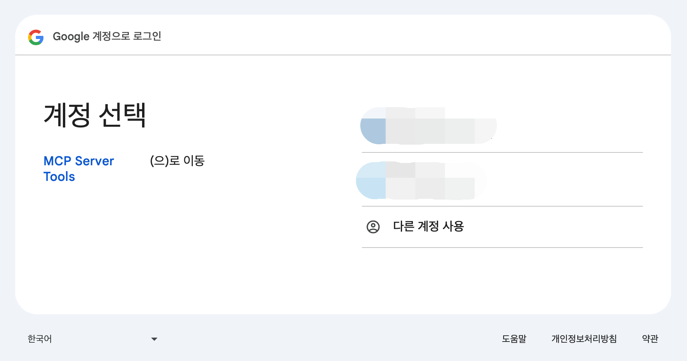

---

## Claude Desktop 에서 Gmail MCP 설정

Claude Desktop 의 설정에서 개발자 설정으로 이동합니다.
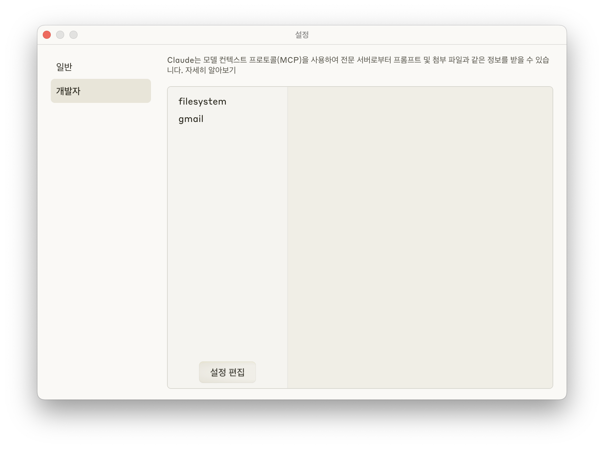

설정 편집을 클릭하면 MCP 설정용 JSON 파일을 확인할 수 있습니다. 확인된 설정 파일을 편집할 수 있는 편집기로 열어 다음과 같이 작성하세요.

``` json
{
  "mcpServers": {
    "gmail": {
      "command": "npx",
      "args": [
        "@gongrzhe/server-gmail-autoauth-mcp"
      ]
    }
  }
}
```

작성이 완료되었으면, 저장 후 Claude Desktop 은 종료 후 다시 실행합니다.

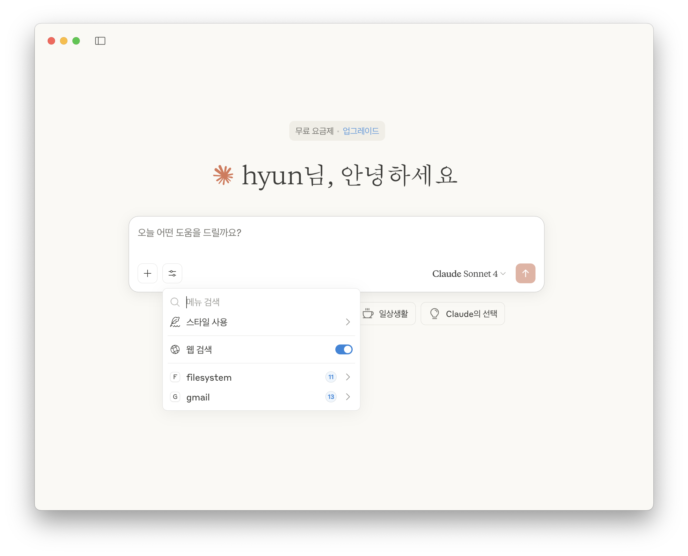

gmail 이라는 MCP Server 가 보이면 완료되었습니다.

## Cursor IDE 에서 Gmail MCP 설정

오른쪽 상단의 톱니바퀴 모양의 아이콘을 클릭하면 Cursor Settings 가 활성화 됩니다.

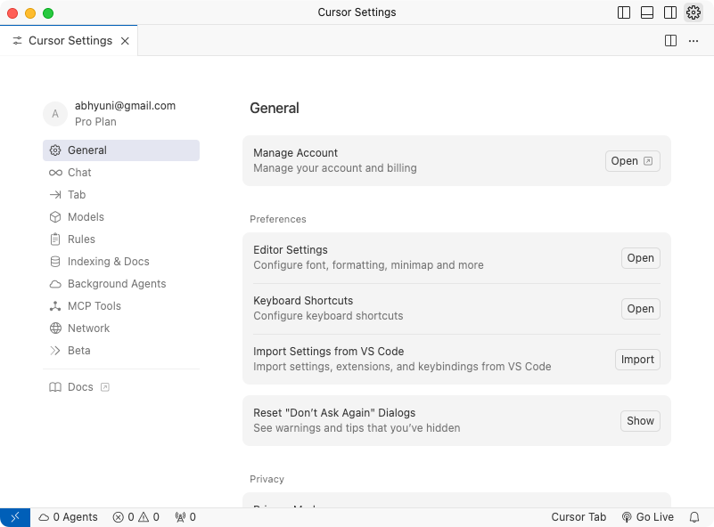

왼쪽 메뉴의 MCP Tools 에서 `New MCP Server` 를 클릭해서 Gmail MCP 구성을 합니다.

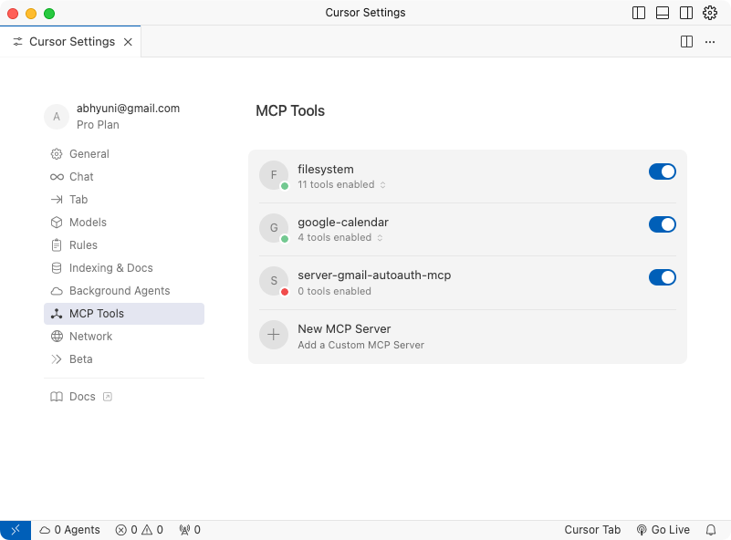

구성 방법은 Claude Desktop 과 동일 합니다.

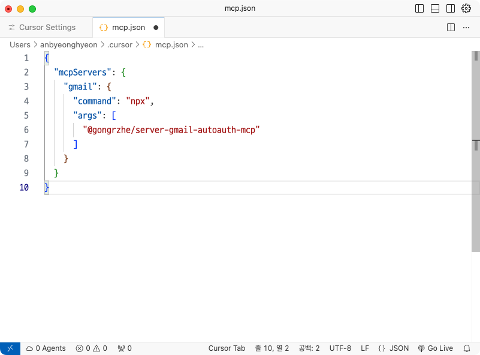

``` json
{
  "mcpServers": {
    "gmail": {
      "command": "npx",
      "args": [
        "@gongrzhe/server-gmail-autoauth-mcp"
      ]
    }
  }
}
```